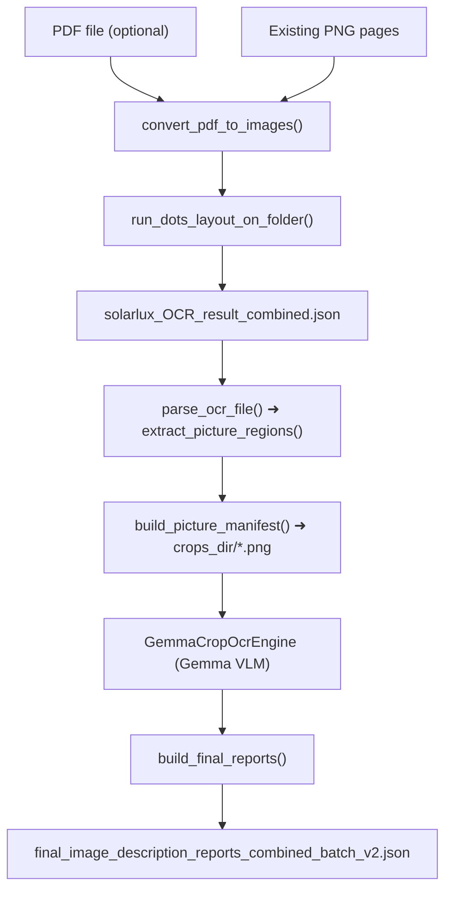

# efficient_llm

[](https://www.python.org/downloads/)
[](https://opensource.org/licenses/MIT)

`efficient_llm` is a local-first OCR and layout understanding pipeline for technical PDF and image documents.  
It combines **DOTS layout OCR** with **Gemma-based picture-region OCR** to produce structured, high-quality JSON outputs — without relying on external APIs.

This module is part of the [`pure_visual_grounding`](https://github.com/CRAI-KI-Reallabor/pure_visual_grounding) project and is distributed as an **optional extra**.

Install via:

```bash
pip install "pure-visual-grounding[efficient-llm]"
```

---

## Overview

The pipeline performs the following steps:

1. **PDF → PNG conversion** using PyMuPDF  
2. **Layout-aware OCR** using DOTS (layout elements + text; also detects `Picture` regions)  
3. **Picture-region cropping and OCR** using Gemma  
4. **Final combined JSON report generation**  

Designed for reproducible, GPU-accelerated, fully local inference.

---

## Features

- Multi-page PDF → PNG conversion
- DOTS-based layout extraction (per-page JSON)
- Automatic detection of `Picture` regions
- Picture-region cropping with configurable padding
- Gemma OCR on cropped technical drawing regions
- Final merged JSON report: DOTS layout + Gemma picture OCR
- Memory-safe batched inference with explicit GPU cleanup
- CLI entrypoint so you can run the whole pipeline without editing any Python code
- Easy integration into the broader **pure-visual-grounding** stack
- Hugging Face authentication supported where required

---

## Architecture (Mermaid)



---

## Quick Start

### 1. Install (via pure-visual-grounding extra)

```bash
pip install "pure-visual-grounding[efficient-llm]"
```

Make sure you also install a **CUDA-enabled PyTorch build** that matches your GPU (see *Environment & requirements*).

### 2. Minimal CLI usage (PDF → DOTS + Gemma)

```bash
python -m efficient_llm.example_test_batch   --dots-model "/path/to/DotsOCR"   --image-folder "./run/pngs"   --pdf "./input.pdf"   --crops-dir "./run/crops"   --reports-dir "./run/reports"
```

This will:

1. Convert `./input.pdf` to PNG pages in `./run/pngs` (if the folder is empty),
2. Run DOTS layout OCR and save `./run/pngs/solarlux_OCR_result_combined.json`,
3. Detect all `Picture` regions and crop them into `./run/crops`,
4. Run Gemma OCR on each crop,
5. Save the final merged JSON to `./run/reports/final_image_description_reports_combined_batch_v2.json`.

### 3. Programmatic usage

#### Basic usage (single PDF)

```python
import json
from efficient_llm.config import SolarluxPipelineConfig
from efficient_llm.pipeline import run_pipeline

cfg = SolarluxPipelineConfig(
    dots_model_path="/path/to/DotsOCR",
    pdf_path="samples/document.pdf",
    image_folder="./run/pngs",
    crops_dir="./run/crops",
    reports_dir="./run/reports",
)

out_path = run_pipeline(cfg)

with open(out_path, "r", encoding="utf-8") as f:
    report = json.load(f)

print(report[0]["image_name"])
print("num picture regions:", len(report[0]["picture_ocr_result"]))
```

#### Custom processing (tune speed/quality)

```python
import json
from efficient_llm.config import SolarluxPipelineConfig
from efficient_llm.pipeline import run_pipeline

cfg = SolarluxPipelineConfig(
    dots_model_path="/path/to/DotsOCR",
    pdf_path="samples/document.pdf",
    image_folder="./run_custom/pngs",
    crops_dir="./run_custom/crops",
    reports_dir="./run_custom/reports",

    # performance knobs
    attn_impl="flash_attention_2",
    batch_size=18,
    base_max_new_tokens=4000,
    extra_max_new_tokens=4000,

    # Gemma knobs
    gemma_model_id="google/gemma-3n-e4b-it",
    crop_upscale=2.0,

    # crop knobs
    padding=12,

    # device / dtype knobs
    device_map="auto",
    torch_dtype="bfloat16",
)

out_path = run_pipeline(cfg)
report = json.loads(out_path.read_text(encoding="utf-8"))
print("pages:", len(report))
```

#### Advanced usage (batch multiple PDFs)

> Note: this loop will reload models per PDF. For maximum throughput, create a shared DOTS + Gemma engine and reuse it across runs (similar to `local_dual_llm` engine reuse).

```python
import json
from pathlib import Path
from efficient_llm.config import SolarluxPipelineConfig
from efficient_llm.pipeline import run_pipeline

pdfs = sorted(Path("./pdfs").glob("*.pdf"))

for pdf in pdfs:
    cfg = SolarluxPipelineConfig(
        dots_model_path="/path/to/DotsOCR",
        pdf_path=str(pdf),
        image_folder=f"./run_batch/{pdf.stem}/pngs",
        crops_dir=f"./run_batch/{pdf.stem}/crops",
        reports_dir=f"./run_batch/{pdf.stem}/reports",
        batch_size=18,
        base_max_new_tokens=4000,
        extra_max_new_tokens=4000,
    )

    out_path = run_pipeline(cfg)
    report = json.loads(out_path.read_text(encoding="utf-8"))
    print(pdf.name, "-> pages:", len(report))
```

---

## Repository structure

```text
efficient_llm/
  __init__.py
  config.py
  engine.py
  example_test_batch.py
  pipeline.py
  prompts.py
  requirements.txt
  utils.py
```

---

## Environment & requirements

### Python and hardware

- Python **3.10+** (tested with **3.12** via Conda)
- CUDA-capable GPU strongly recommended  
  (CPU-only will be extremely slow for large PDFs or high token limits)

### Core Python dependencies

At minimum, you need:

- `torch` (CUDA build recommended)
- `transformers`
- `accelerate`
- `pymupdf`
- `Pillow`
- `flash-attn` (for DOTS / Gemma efficiency on modern GPUs)

All other Python dependencies are listed in:

```text
efficient_llm/requirements.txt
```

Install them manually (standalone usage) with:

```bash
pip install -r efficient_llm/requirements.txt
```

Or install via the main package:

```bash
pip install "pure-visual-grounding[efficient-llm]"
```

(This pulls in the same dependency set via the `efficient-llm` extra.)

---

## Recommended CUDA / PyTorch / flash-attn setup

Below is a **tested working setup** (example on Linux with Conda and CUDA 12.8):

### 1. Create Conda environment

```bash
conda create -n rednote_ocr python=3.12 -y
conda activate rednote_ocr
```

### 2. Install CUDA-enabled PyTorch

Either start with the default wheel:

```bash
pip3 install torch torchvision
```

or install the tested, CUDA-specific versions:

```bash
pip3 install torch==2.7.0 torchvision==0.22.0 torchaudio==2.7.0   --index-url https://download.pytorch.org/whl/cu128
```

You should see something like:

```python
import torch

print("torch:", torch.__version__)        # e.g. 2.7.0+cu128
print("torch cuda:", torch.version.cuda)  # e.g. 12.8
print("cuda available:", torch.cuda.is_available())
print("gpu:", torch.cuda.get_device_name(0) if torch.cuda.is_available() else "N/A")
```

### 3. Install flash-attn

```bash
pip install "flash-attn==2.8.0.post2" --no-build-isolation
```

> Note: Other `flash-attn` versions (e.g. `2.8.2`) may work, but `2.8.0.post2` is the tested version for this setup.

---

## Installation (project-local)

If you are developing inside the repository (editable install):

```bash
python -m venv .venv           # or use Conda env from above
source .venv/bin/activate      # Linux / macOS
# .\.venv\Scripts\Activate.ps1 # Windows PowerShell

pip install -r efficient_llm/requirements.txt
```

---

## Ensure `qwen_vl_utils` is available

DOTS uses Qwen-style vision utilities and requires:

```python
from qwen_vl_utils import process_vision_info
```

This module **must** be importable in your environment.

### Options

- If it is already installed: nothing to do.
- If it is a local file/module:  
  - add it to `PYTHONPATH`, or  
  - vendor it into this repository.

### Quick check

```bash
python -c "from qwen_vl_utils import process_vision_info; print('OK')"
```

---

## Models

### DOTS OCR model

You must have the DOTS weights locally, for example:

```text
/path/to/DotsOCR
```

Pass this directory via:

```bash
--dots-model "/path/to/DotsOCR"
```

### Gemma model

Default Gemma model used for picture-region OCR:

```text
google/gemma-3n-e4b-it
```

On first run, this model will be downloaded from Hugging Face.

Some Gemma models require authentication:

```bash
huggingface-cli login
```

---

## Transformer version compatibility (DOTS + Gemma)

### The issue

- Legacy DOTS OCR code was tied to older `transformers` versions.
- Newer Gemma models require modern `transformers`.
- After upgrading `transformers`, DOTS failed because its custom processor class no longer matched the expected signature.

Recent `transformers` versions expect a `video_processor` argument in `Qwen2_5_VLProcessor`, which was missing in the original DOTS processor wrapper.

### The fix

The DOTS processor implementation was updated so that DOTS and Gemma can share the **same modern `transformers` version**.

**Modified file (inside your DOTS model repo):**

```text
dots.ocr/weights/DotsOCR/configuration_dots.py
```

**Updated processor implementation:**

```python
class DotsVLProcessor(Qwen2_5_VLProcessor):
    attributes = ["image_processor", "tokenizer", "video_processor"]

    def __init__(
        self,
        image_processor=None,
        tokenizer=None,
        video_processor=None,
        chat_template=None,
        **kwargs,
    ):
        super().__init__(
            image_processor,
            tokenizer,
            video_processor=video_processor,
            chat_template=chat_template,
        )

        self.image_token = "<|imgpad|>" if not hasattr(tokenizer, "image_token") else tokenizer.image_token
        self.image_token_id = 151665 if not hasattr(tokenizer, "image_token_id") else tokenizer.image_token_id
```

The processor is then registered:

```python
AutoProcessor.register("dots_ocr", DotsVLProcessor)
CONFIG_MAPPING.register("dots_ocr", DotsOCRConfig)
```

### Result

- DOTS OCR works with the latest `transformers` versions.
- Gemma runs in the same environment without downgrading dependencies.
- No changes are required in the `efficient_llm` pipeline code.

---

## How to run (CLI)

The primary CLI entrypoint is:

```text
efficient_llm/example_test_batch.py
```

### Show CLI help

```bash
python -m efficient_llm.example_test_batch -h
```

### Case A: Run using a PDF (PDF → PNG)

```bash
python -m efficient_llm.example_test_batch   --dots-model "/path/to/DotsOCR"   --image-folder "/path/to/output_png_folder"   --pdf "/path/to/your_file.pdf"   --crops-dir "/path/to/output_crops"   --reports-dir "/path/to/output_reports"
```

#### What happens

1. If `--image-folder` contains **no** PNG files, the PDF is converted to PNG pages.
2. DOTS runs on all PNGs in `--image-folder` and saves:

   ```text
   <image-folder>/solarlux_OCR_result_combined.json
   ```

3. All `Picture` regions from DOTS output are cropped into `--crops-dir`.
4. Gemma OCR runs on each crop.
5. A final combined report is written to `--reports-dir`.

### Case B: Run using existing PNGs (skip PDF)

```bash
python -m efficient_llm.example_test_batch   --dots-model "/path/to/DotsOCR"   --image-folder "/path/to/png_folder"   --crops-dir "/path/to/output_crops"   --reports-dir "/path/to/output_reports"
```

In this mode the PDF → PNG step is skipped and only DOTS + Gemma are run.

---

## Output files

### 1. DOTS OCR output

```text
<image-folder>/solarlux_OCR_result_combined.json
```

Combined DOTS layout OCR for all processed page images.

### 2. Picture manifest

```text
<crops-dir>/../picture_regions_manifest_summary.json
```

Contains:

- crop image paths
- bounding boxes
- page and region metadata

### 3. Final combined report

```text
<reports-dir>/final_image_description_reports_combined_batch_v2.json
```

High-level JSON structure:

```json
[
  {
    "image_name": "page_1.png",
    "ocr_pass_result": [...],
    "picture_ocr_result": [
      {
        "region_id": "...",
        "bbox": [...],
        "text": "OCR output from Gemma"
      }
    ]
  }
]
```

---

## CLI options

### Required

- `--dots-model` : path to DOTS model directory  
- `--image-folder` : folder for PNGs (input or generated)  
- `--crops-dir` : directory to store cropped picture regions  
- `--reports-dir` : directory to store final report JSON  

### Optional (common)

- `--pdf` : PDF file to convert if PNGs are not present  
- `--padding` : padding (pixels) around picture bboxes (default: `12`)  
- `--batch-size` : DOTS inference batch size (default: `18`)  
- `--base-max-new-tokens` : DOTS generation tokens (default: `12000`)  
- `--extra-max-new-tokens` : DOTS retry tokens if JSON parse fails (default: `15000`)  
- `--gemma-model-id` : Gemma Hugging Face model ID (default: `google/gemma-3n-e4b-it`)  
- `--crop-upscale` : image upscale factor before Gemma OCR (default: `2.0`)  

### Example: reduce batch size to avoid OOM

```bash
python -m efficient_llm.example_test_batch   --dots-model "/path/to/DotsOCR"   --image-folder "./pngs"   --pdf "./doc.pdf"   --crops-dir "./crops"   --reports-dir "./reports"   --batch-size 6
```

---

## Performance and memory notes

DOTS inference can be memory-heavy for:

- large page images
- high `max_new_tokens` values
- large `batch-size`

If you hit **CUDA out-of-memory** errors:

- lower `--batch-size`
- lower `--base-max-new-tokens` and `--extra-max-new-tokens`
- split very large PDFs into smaller batches
- ensure other GPU-heavy processes are not running

The pipeline explicitly:

- clears intermediate tensors between batches
- calls GPU memory cleanup hooks on model shutdown

---

## Experiments & Performance Results

### Hardware Environment

All performance measurements were taken on a local workstation with:

- **CPU:** AMD Ryzen Threadripper PRO 5955WX (16 cores / 32 threads)
- **RAM:** 64 GB
- **GPU:** NVIDIA RTX 5000 Ada Generation  
  - Architecture: Ada Lovelace  
  - VRAM: 32 GB GDDR6  
  - Tensor Cores: Yes (bf16 / fp16 supported)  
  - CUDA available: True  

This setup is representative of a high-end workstation suitable for running large VLMs like **DOTS OCR** and **Gemma**.

---

### Baseline: No Flash-Attn, No Real Batching

Initial experiments used DOTS OCR with a simple per-page flow (effectively batch size ≈ 1) and **no Flash-Attention**:

- Implemented full **DOTS-OCR → Gemma VLM** pipeline:
  - PDF → PNG conversion
  - DOTS layout OCR
  - Picture-region cropping
  - Gemma OCR on crops
  - Final merged JSON per page
- Fixed major configuration issues:
  - Correct model loading and GPU device placement
  - Stable GPU utilization
  - Token handling and JSON parsing (retries when output truncated)
- Tested various optimization knobs:
  - Lower `max_new_tokens`
  - Simple “batch-like” loops (but not true batched generation)
  - Different token ranges and environment tweaks

**Observed bottleneck**

- DOTS **generation** was the dominant cost.
- Even after tuning, **per-page inference time was ~25–35 seconds**, depending on layout complexity.
- JSON parsing retries (when output was cut off due to token limits) added extra latency.
- GPU memory usage was high (~20–26 GB) despite low effective batch size.

Summary of the baseline:

- Inference time: **~25–35s/image**
- VRAM usage: **~20–26 GB**
- Main bottleneck: **DOTS generation + JSON retry logic**
- Batching: practically **no real batching** (pages processed one-by-one)

---

### Intermediate: Flash-Attention Without True Batching

The next step was to enable **Flash-Attention** while still keeping the pipeline largely **single-page / non-batched** in practice.

- Flash-Attn was enabled at the model level.
- However, because the pipeline was still effectively doing **one page at a time**, the memory footprint remained high.
- VRAM usage in this mode remained around **~26 GB**.
- Throughput improvements were modest because GPU utilization was still underwhelming (no large batches to amortize overhead).

Key takeaway:

- **Flash-Attn alone** (without restructuring to real batched inference) did **not** fix VRAM usage or throughput enough.
- The real gains only appeared after enabling **both** Flash-Attn **and** proper batching inside the DOTS generation loop.

---

### Flash-Attention + Batched Inference (Real Speedup)

After restructuring the DOTS pipeline to do **true batched generation** (multiple pages in a single forward pass) **and** keeping Flash-Attn enabled:

- Effective VRAM usage per batch became manageable.
- Larger batches (6, 9, 18 images per batch) became stable.
- Throughput improved dramatically.

Approximate performance (DOTS + picture-region Gemma OCR, with Flash-Attn and true batching):

| Batch size | `max_new_tokens` | Flash-Attn | VRAM used (approx) | Time per image (approx) | Notes                                         |
|-----------:|------------------|-----------:|--------------------:|-------------------------:|-----------------------------------------------|
| 2          | default          | ON         | ~6 GB               | ~34 s / image           | First batched Flash-Attn test, small batch    |
| 6          | default          | ON         | ~8 GB               | ~15 s / image           | Better utilization, clear win vs baseline     |
| 9          | default          | ON         | ~8 GB               | ~11 s / image           | Good balance between speed and VRAM           |
| 18         | default          | ON         | ~13 GB              | ~10 s / image           | Large batch, high GPU utilization             |
| 18         | 4000             | ON         | ~13.5 GB            | ~6 s / image            | JSON retries eliminated, best overall run     |

Key observations:

- The **combination** of:
  - Flash-Attn  
  - True batched inference (batch size up to 18)  
  is what unlocked the major gains.
- Going from tiny **batches** (1 page) to **18 pages per batch** reduced per-image latency from **~34s → ~10s**.
- Increasing `max_new_tokens` to **4000** removed most JSON re-generation passes:
  - No extra retry passes → **postprocessing time ≈ 0s**
  - End-to-end per-page latency around **~6–7 seconds**

---

### Final Optimized Configuration

**Best-performing setup on RTX 5000 Ada (32 GB VRAM):**

- **Batch size:** `18`
- **Flash-Attention:** Enabled
- **DOTS `max_new_tokens`:** `4000`
- **VRAM usage:** ~**13–13.5 GB**
- **Average time per image:** **~6.7 seconds**
- **JSON retries:** effectively **0** (due to sufficient token budget)

Compared to the original baseline (**~25–35s/image, no batching, no Flash-Attn**):

- Overall speedup: **≈ 4–5× faster per page**
- GPU utilization: significantly better (multiple pages per forward pass)
- VRAM usage: controlled, leaving plenty of headroom within the 32 GB envelope.

---

## Troubleshooting

### `ModuleNotFoundError: efficient_llm`

Run all commands from the directory **above** `efficient_llm/`, for example:

```bash
python -m efficient_llm.example_test_batch -h
```

Or ensure that `pure-visual-grounding[efficient-llm]` is properly installed in your environment.

### `ModuleNotFoundError: qwen_vl_utils`

Ensure `qwen_vl_utils` is installed or on `PYTHONPATH`.

Quick test:

```bash
python -c "from qwen_vl_utils import process_vision_info; print('OK')"
```

### Gemma authentication error

You must be logged into Hugging Face:

```bash
huggingface-cli login
```

### DOTS model not found

Double-check the path passed to `--dots-model` and make sure it points to the **DOTS model directory**, not a parent folder.

---

## Minimal quickstart (CLI recap)

```bash
python -m efficient_llm.example_test_batch   --dots-model "/path/to/DotsOCR"   --image-folder "./run/pngs"   --pdf "./input.pdf"   --crops-dir "./run/crops"   --reports-dir "./run/reports"
```

---

## Contributing

PRs are welcome. Please align with the existing prompt structures and keep pipeline outputs **strictly JSON** (no extra commentary in model responses).

---

## License

MIT License (see root `LICENSE`).

- **Code in this repository** is released under the [MIT License](https://opensource.org/licenses/MIT).
- **DOTS OCR** and **Gemma models** are subject to their **own licenses** and usage restrictions.
- This repository only provides **pipeline orchestration** and does **not** redistribute any model weights.

---

## Author

Author: **Strategion** (<development@strategion.de>)

---

## Keywords

PDF, OCR, Vision, Qwen2.5-VL, Document Processing, Technical Documents, DOTS OCR, Gemma, Vision-Language Models, Layout-aware OCR, Technical Drawings, Engineering Documents, Crop OCR, PDF-to-Image, Batched Inference, FlashAttention, GPU Inference, Local-first Inference, Structured JSON Outputs
